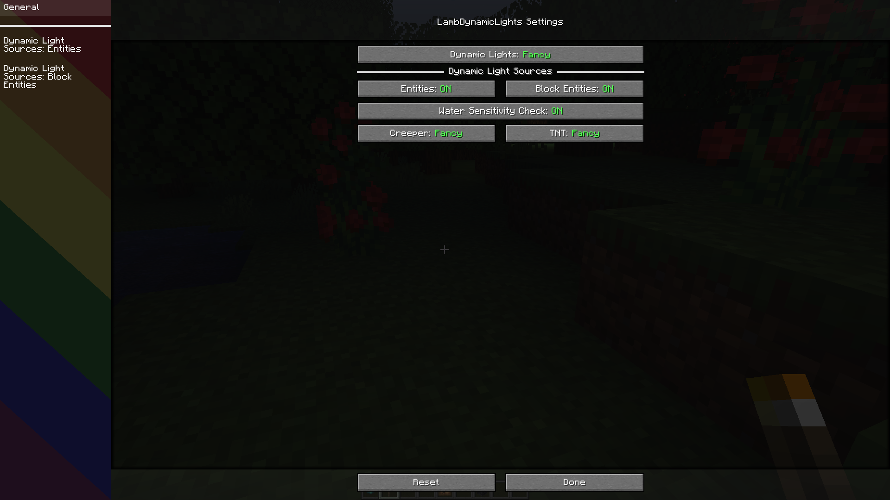
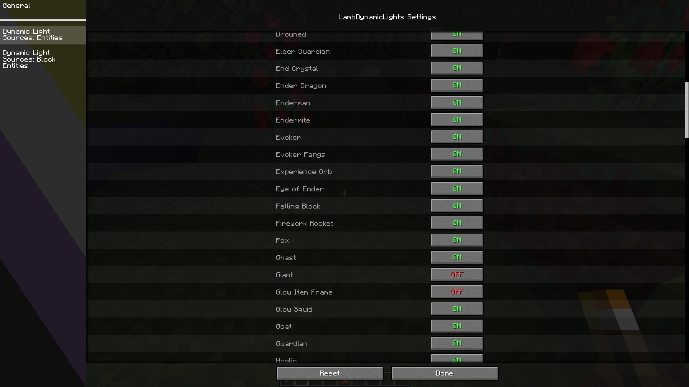

# RyoamicLights

LambDynamicLights unofficial flint loader port. DO NOT BOTHER THE ORIGINAL AUTHORS FOR ISSUES!

A dynamic lights mod for flint loader.

## 📖 What's this mod?

It's dark outside, extremely dark...
You can't see a lot in the darkness, you wish you had a torch,
or a lantern to hold and see in the light...

And this is now possible with this mod as it adds dynamic lights to the game.
You can see in the darkness thanks to your torch now!

This mod adds dynamic lights to Minecraft. Dynamic lights are lights created by an entity holding an
item which makes light as a block, or created by an entity on fire, etc.

[Trailer](https://www.youtube.com/embed/r8r1TNG45tM?wmode=transparent)

Searching other mods to replace OptiFine?
[Check out this list!](https://lambdaurora.dev/optifine_alternatives)

## ✅ Features:

- Dynamic lights.
- Settings to select how smooth the dynamic lighting is.
- Works with some modded items.
- Any entity holding an item which emits light will emit light!
- Magma cubes emit light.
- Spectral arrows emit light.
- Burning entities emit light.
- Blazes emit light.
- Some items like torches, soul torches, etc. will not light up in water.
- Quick and simple API for developers.
- And more!

## Screenshots

### Items emit light

Dropped items which already emit light as a block, will also dynamically emit light!

### Held items emit light

Light is emitted when entities hold light emitting items.

### Fire! Fire! Fire!

Any entity on fire will emit light!

### Spectral arrows

Spectral arrows will emit a very weak light!

### Different luminance!

Light emitted from items depend on the light emitted from their respective blocks!

### Configuration GUI

## 📖 Usage

Using this mod is very simple!

Install it in your mods folder along with [ObsidianUI](https://modrinth.com/mod/obsidianui), (and [Embeddium](https://modrinth.com/mod/embeddium) if wanted for better performances).

You will notice nothing at first but if you go into the video options or into the settings screen of the mod via Forge's Mod List, you will notice an option called Dynamic Lights which is by default off, choose the wanted configuration and enjoy!
You can also configure the mod by editing the file in `config/lambdynlights.toml`.

### Build

Just do `./gradlew build` and everything should build just fine!

## 📖 How does it work internally?

Check [this documentation](HOW_DOES_IT_WORK.md).

## 📖 Is there an API? How to use it as a developer?

Check [this documentation](API.md).

# 📖 Compatibility

- [Embeddium](https://modrinth.com/mod/embeddium) is recommended for better performances.
- **OptiFine/OptiForge is obviously incompatible.**